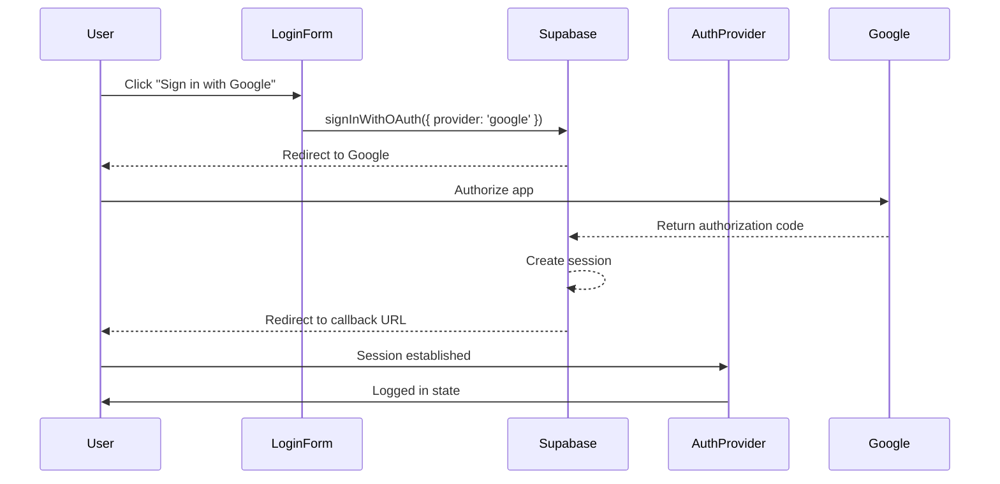

# Google & Facebook OAuth Login Implementation Plan

## Overview

This document outlines the complete implementation plan for adding Google and Facebook as third-party login providers using Supabase OAuth integration.

---

## Part 1: Obtaining OAuth Credentials

### 1.1 Google OAuth Setup

Follow these steps to obtain Google OAuth credentials:

1. **Go to Google Cloud Console**
   - Visit: https://console.cloud.google.com/
   - Create a new project or select existing one

2. **Configure OAuth Consent Screen**
   - Navigate to **APIs & Services** > **OAuth consent screen**
   - Select **External** user type
   - Fill in required fields:
     - App name: "Car Rental System"
     - User support email: your email
     - Developer contact email: your email
   - Add scopes: `email`, `profile`, `openid`
   - Add test users (for development)

3. **Create OAuth Credentials**
   - Go to **APIs & Services** > **Credentials**
   - Click **Create Credentials** > **OAuth client ID**
   - Application type: **Web application**
   - Add authorized JavaScript origins:
     - `http://localhost:3000` (development)
     - Your production URL
   - Add authorized redirect URIs:
     - `https://[your-supabase-project].supabase.co/auth/v1/callback`
   - Copy **Client ID** and **Client Secret**

### 1.2 Facebook OAuth Setup

Follow these steps to obtain Facebook OAuth credentials:

1. **Go to Facebook Developer Portal**
   - Visit: https://developers.facebook.com/
   - Click **My Apps** > **Create App**
   - Select **Consumer** app type

2. **Configure App Settings**
   - Add app name and contact email
   - Navigate to **Settings** > **Basic**
   - Note your **App ID** and **App Secret**

3. **Add OAuth Redirect URI**
   - Go to **Products** > **Facebook Login** > **Settings**
   - Add Valid OAuth Redirect URIs:
     - `https://[your-supabase-project].supabase.co/auth/v1/callback`
   - Save changes

4. **Make App Public**
   - Go to **App Review** > **Permissions and Features**
   - Make `public_profile` and `email` features available

---

## Part 2: Supabase Configuration

### 2.1 Configure OAuth Providers in Supabase Dashboard

1. Go to your Supabase Dashboard
2. Navigate to **Authentication** > **Providers**
3. Enable **Google**:
   - Client ID: (from Google Cloud Console)
   - Client Secret: (from Google Cloud Console)
   - Redirect URL: `https://[your-project].supabase.co/auth/v1/callback`
4. Enable **Facebook**:
   - Client ID: (from Facebook Developer Portal)
   - Client Secret: (from Facebook Developer Portal)
   - Redirect URL: `https://[your-project].supabase.co/auth/v1/callback`

### 2.2 Environment Variables Required

Add these to your `.env` file:

```env
# Google OAuth
NEXT_PUBLIC_GOOGLE_CLIENT_ID=your-google-client-id
GOOGLE_CLIENT_SECRET=your-google-client-secret

# Facebook OAuth
NEXT_PUBLIC_FACEBOOK_CLIENT_ID=your-facebook-app-id
FACEBOOK_CLIENT_SECRET=your-facebook-app-secret
```

---

## Part 3: Implementation Steps

### 3.1 Update Environment Variables

Add OAuth credentials to `.env` file after obtaining them from Google and Facebook.

### 3.2 Update LoginForm Component

**File:** `app/components/LoginForm.tsx`

**Changes needed:**
- Import Supabase client
- Add OAuth sign-in functions using `signInWithOAuth`
- Add Google and Facebook login buttons with icons
- Handle redirect after OAuth login

**Mermaid Flow - OAuth Login Flow:**


### 3.3 Update AuthProvider

**File:** `app/components/context/AuthProvider.jsx`

**Changes needed:**
- Add OAuth session handling in useEffect
- Check for Supabase session on initial load
- Handle OAuth callback tokens from URL hash

### 3.4 Create OAuth Callback Handler (if needed)

If using server-side session handling, create API route to exchange OAuth tokens.

---

## Part 4: Technical Details

### 4.1 Supabase OAuth Methods

```typescript
// Client-side OAuth sign-in
const { data, error } = await supabase.auth.signInWithOAuth({
  provider: 'google',
  options: {
    redirectTo: 'http://localhost:3000/auth/callback',
    scopes: 'email profile'
  }
})

// Client-side OAuth sign-in (Facebook)
const { data, error } = await supabase.auth.signInWithOAuth({
  provider: 'facebook',
  options: {
    redirectTo: 'http://localhost:3000/auth/callback',
    scopes: 'email public_profile'
  }
})
```

### 4.2 Handling OAuth Session

After redirect from OAuth provider, the session is automatically handled by Supabase client. The AuthProvider needs to:

1. Check for session in URL hash/params
2. Set session in state
3. Generate custom JWT if needed
4. Redirect to intended destination

---

## Part 5: Testing Checklist

- [ ] Google OAuth login works from development environment
- [ ] Facebook OAuth login works from development environment
- [ ] OAuth login creates/updates user profile in database
- [ ] User is redirected to correct page after login
- [ ] Logout works correctly for OAuth users
- [ ] Error handling shows appropriate messages
- [ ] Works in production environment

---

## Files to Modify

| File | Changes |
|------|---------|
| `.env` | Add OAuth credentials |
| `app/components/LoginForm.tsx` | Add OAuth buttons and handlers |
| `app/components/context/AuthProvider.jsx` | Handle OAuth sessions |
| `lib/supabase.ts` | Ensure OAuth methods available |

---

## Next Steps After Credentials Obtained

Once you have your OAuth credentials:

1. Update `.env` with credentials
2. Configure providers in Supabase Dashboard
3. Switch to Code mode to implement the changes
4. Test the OAuth login flow
