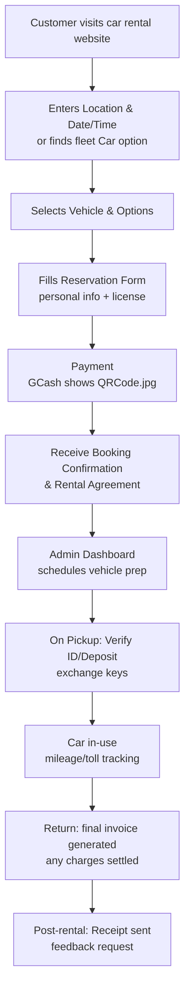

# Car Rental System - Clear Flow

## Customer Journey Flow



---

## Step-by-Step Flow Details

### Step A: Customer visits car rental website
- **Landing Page:** `/` - Home page with hero section, featured cars
- **Navigation:** Header with Home, Cars, About, Contact, FAQ
- **Entry Points:**
  - Browse featured cars on homepage
  - Direct link to `/cars` fleet selection

---

### Step B: Enters Location & Date/Time OR finds fleet Car option

**Option 1: Search by Location & Date**
- **Location:** [`hero-section.tsx`](app/components/providers/home/hero-section.tsx)
- **Components:**
  - Pickup location dropdown (branches)
  - Pickup date & time picker
  - Return date & time picker
  - Return location (same or different branch)
- **Action:** System checks availability for selected dates

**Option 2: Browse Fleet Directly**
- **Route:** [`/cars`](app/cars/page.tsx)
- **Features:**
  - Grid view of all available vehicles
  - Filter by: car type, price range, transmission
  - Sort by: price, popularity, newest

---

### Step C: Selects Vehicle & Options

**Route:** [`/cars/[id]`](app/cars/[id]/page.tsx)

**Vehicle Details Page:**
- Car images gallery
- Vehicle specifications (seats, transmission, fuel)
- Daily rate display
- Availability calendar
- **Add-ons/Options:**
  - Insurance (basic/comprehensive)
  - Additional driver
  - GPS navigation
  - Child seat
  - Delivery/pickup service

**Action:** Click "Book Now" to proceed

---

### Step D: Fills Reservation Form

**Component:** [`booking-modal.tsx`](app/components/providers/home/booking-modal.tsx)

**Form Fields:**
- **Personal Information:**
  - Full name
  - Email address
  - Phone number
  - Address
  
- **Driver's License:**
  - License number
  - Expiry date
  - Upload license image (front/back)
  
- **Additional Documents:**
  - Valid ID upload
  - Secondary ID (optional)

**Validation:** All fields required, documents must be uploaded

---

### Step E: Payment (GCash with QR Code)

**Component:** [`PaymentModal.tsx`](app/components/PaymentModal.tsx) or integrated in booking flow

**Payment Methods:**
1. **GCash** ← User wants to display static QRCode.jpg
2. Bank Transfer
3. Credit/Debit Card
4. PayMaya

**GCash Payment Flow:**
- Display [`QRCode.jpg`](public/assets/QRCode.jpg) - static image for customer to scan
- Show GCash number to send payment to
- Customer scans QR and sends payment
- Customer enters reference number
- Admin manually verifies payment

**Price Calculation:**
- Base price × number of days
- Add-ons total
- Delivery fee (if applicable)
- Security deposit
- Peak season surcharge (if applicable)

---

### Step F: Receive Booking Confirmation & Rental Agreement

**System Actions:**
1. Generate unique booking reference number (e.g., `BR-XXXX-XXXX`)
2. Create booking record in database
3. Send confirmation email/SMS
4. Generate digital rental agreement

**Confirmation Contains:**
- Booking reference number
- Vehicle details
- Pickup/return dates & times
- Pickup/return locations
- Total amount paid
- Terms and conditions
- Payment proof

**Database Status:** `pending` → `confirmed`

---

### Step G: Admin Dashboard schedules vehicle prep

**Route:** [`/admin/bookings`](app/admin/bookings/page.tsx)

**Admin Actions:**
1. View new booking in dashboard
2. Verify payment (if manual)
3. Schedule vehicle preparation:
   - Car cleaning
   - Fuel check
   - Maintenance check
4. Assign vehicle to booking
5. Prepare rental agreement documents

**Admin Notes:** Add pickup instructions, special requirements

---

### Step H: On Pickup - Verify ID/Deposit, exchange keys

**Process:**
1. Customer arrives at pickup location
2. Staff verifies:
   - Valid ID (matches booking)
   - Driver's license (valid and not expired)
   - Payment/deposit confirmation
3. Conduct vehicle inspection:
   - Photo documentation of existing damages
   - Fuel level check
   - Mileage recording
4. Customer pays remaining balance (if any)
5. Digital contract signing (e-signature)
6. Exchange keys

**Database Status:** `confirmed` → `ongoing`

---

### Step I: Car in-use - mileage/toll tracking

**During Rental:**
- Track rental duration
- Optional: GPS tracking for mileage
- Toll fee collection (if applicable)
- Customer can request extension via:
  - System
  - Phone/SMS

**Extension Request Flow:**
- Customer requests extension
- Admin approves based on availability
- Additional fee calculated
- Customer pays online
- Return date updated

---

### Step J: Return - final invoice generated, any charges settled

**Return Process:**
1. Customer returns vehicle
2. Staff conducts return inspection:
   - Photo documentation
   - Compare with pickup photos
   - Check for new damages
   - Fuel level check
   - Mileage check
3. Calculate final charges:
   - Late fees (if overdue)
   - Fuel charges (if not full tank)
   - Damage charges (if any)
4. Generate final invoice
5. Process deposit refund (if applicable)

**Database Status:** `ongoing` → `completed`

---

### Step K: Post-rental - Receipt sent, feedback request

**System Actions:**
1. Send final receipt via email/SMS
2. Process deposit refund (within 3-5 business days)
3. Request customer feedback/rating
4. Update vehicle availability
5. Generate internal reports

**Post-Rental Emails:**
- Final receipt with breakdown
- Deposit refund confirmation (if applicable)
- Feedback/rating request
- Thank you message

---

## System Flow Summary

| Step | Description | Key Components |
|------|-------------|----------------|
| A | Website Visit | Home page, navigation |
| B | Search/Browse | Location/date picker, fleet grid |
| C | Select Car | Car detail page, options |
| D | Fill Form | Booking form, document upload |
| E | Payment | GCash QR, payment processing |
| F | Confirmation | Email, booking reference |
| G | Admin Prep | Dashboard, vehicle assignment |
| H | Pickup | ID verification, inspection, keys |
| I | In-Use | Tracking, extensions |
| J | Return | Final invoice, charges |
| K | Complete | Receipt, refund, feedback |

---

## Key Files for Each Step

| Step | Files |
|------|-------|
| A, B | [`app/page.tsx`](app/page.tsx), [`hero-section.tsx`](app/components/providers/home/hero-section.tsx), [`/cars`](app/cars/page.tsx) |
| C | [`/cars/[id]/page.tsx`](app/cars/[id]/page.tsx), [`car-card.tsx`](app/components/cars/car-card.tsx) |
| D | [`booking-modal.tsx`](app/components/providers/home/booking-modal.tsx) |
| E | [`PaymentModal.tsx`](app/components/PaymentModal.tsx), [`QRCode.jpg`](public/assets/QRCode.jpg) |
| F | [`/api/bookings`](app/api/bookings/route.ts), email notifications |
| G | [`/admin/bookings`](app/admin/bookings/page.tsx), [`AdminSidebar.tsx`](app/components/AdminSidebar.tsx) |
| H | [`/api/inspections`](app/api/inspections/route.ts), vehicle handover |
| I | [`/api/extensions`](app/api/extensions/route.ts), tracking |
| J | [`/api/late-fees`](app/api/late-fees/route.ts), final invoice |
| K | [`/api/notifications`](app/api/notifications/route.ts), feedback system |

---

## GCash QR Code Payment Implementation

To display the static QRCode.jpg when customer selects GCash:

```jsx
// In PaymentModal.tsx or booking-modal.tsx
{selectedPaymentMethod === 'gcash' && (
  <div className="gcash-payment">
    
    <p>Scan this QR code with your GCash app</p>
    <p>Or send payment to: [GCash Number]</p>
    <input 
      type="text" 
      placeholder="Enter GCash reference number" 
    />
  </div>
)}
```

**QR Code Location:** [`public/assets/QRCode.jpg`](public/assets/QRCode.jpg)
